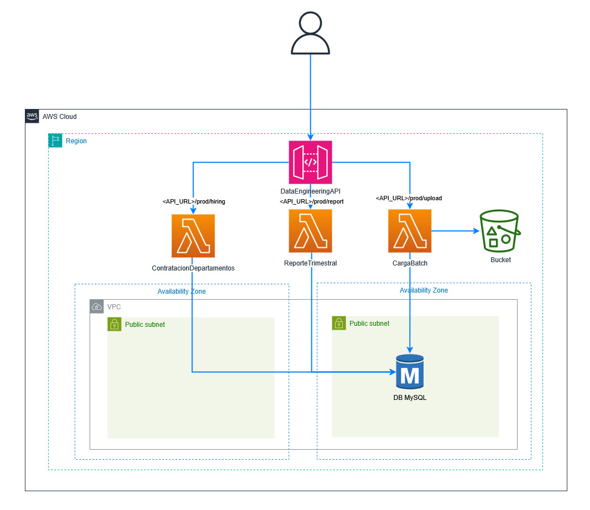

# Data Engineering Coding Challenge

Este repositorio contiene la infraestructura necesaria para desplegar una solución en AWS utilizando CloudFormation. Incluye una base de datos MySQL en RDS, una función Lambda para procesar cargas de datos, y un API Gateway para la interacción con la API.

## 🚀 Despliegue de la Infraestructura

Sigue estos pasos para desplegar la infraestructura en AWS:

### 1️⃣ **Clonar el repositorio**

```bash
git clone https://github.com/josezamalloa/api_db_challenge.git
cd api_db_challenge
```

### 2️⃣ **Desplegar la infraestructura con AWS CloudFormation**

```bash
aws cloudformation deploy \
    --template-file plantilla.yaml \
    --stack-name reto \
    --capabilities CAPABILITY_NAMED_IAM \
    --parameter-overrides DBUser=<usuario> DBPassword=<contraseña>
```

📌 **Reemplaza <usuario> y <contraseña> con las credenciales que deseas utilizar**

## 📂 **Uso de la API para carga de archivos**

Una vez desplegado, la API permite cargar archivos CSV directamente en la base de datos MySQL a través de API Gateway.

### 🔹 **Cargar un archivo CSV en la base de datos**

```bash
curl -X POST "https://<API_URL>/prod/upload?table=departments" \
     -H "Content-Type: text/csv" \
     --data-binary "@archivo.csv"
```

> 📌 **Reemplaza **<API_URL>** con la URL del API Gateway desplegada y especifica el nombre de la tabla al invocar la API**

### 🔹 **Obtener reporte trimestral de contrataciones**

```bash
curl -X GET "https://<API_URL>/prod/report"
```

### 🔹 **Obtener departamentos con más contrataciones que el promedio**

```bash
curl -X GET "https://<API_URL>/prod/hiring"
```

## 📷 Arquitectura de la Solución

La siguiente imagen muestra la arquitectura desplegada en AWS:



## 🔥 **Notas**

- Asegúrate de tener configurado AWS CLI con las credenciales adecuadas.
- La base de datos RDS puede tardar unos minutos en estar lista después del despliegue.